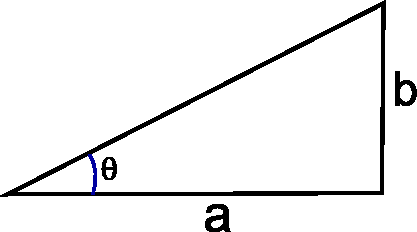
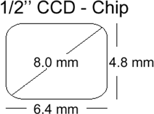

# Exercise2 - Cameras and Lenses


## Introduction

The purpose of this exercise is to use Python to calculate camera and scene specific values.

## Learning Objectives

After completing this exercise, the student should be able to do the following:

- Create a Python function that uses the thin lens equation to compute either the focal length (f), where the rays are focused (b) or an object distance (g) when two of the other measurements are given


## Computing camera parameters

### Exercise 1

Explain how to calculate the angle $\theta$ when $a$ and $b$ is given
in the figure below. Calculate $\theta$ (in degrees) when
$a = 10$ and $b=3$ using the function `math.atan2()`. Remember to import `math` and find out what `atan2` does.



### Exercise 2

Create a Python function called `camera_b_distance`.

The function should accept two arguments, a focal length f and an
object distance g. It should return the distance from the lens to
where the rays are focused (b) (where the CCD should be placed)

The function should start like this:

```python
def camera_b_distance(f, g):
    """
    camera_b_distance returns the distance (b) where the CCD should be placed
    when the object distance (g) and the focal length (f) are given
    :param f: Focal length
    :param g: Object distance
    :return: b, the distance where the CCD should be placed
    """
```

It should be based on Gauss' lens equation:
$$\frac{1}{g} + \frac{1}{b} = \frac{1}{f}$$

You should decide if your function should calculate distances in mm or
in meters, but remember to be consistent!

Use your function to find out where the CCD should be placed when the
focal length is 15 mm and the object distance is 0.1, 1, 5, and 15
meters.

What happens to the place of the CCD when the object distance is increased?

## Camera exercise

In the following exercise, you should remember to explain when
something is in mm and when it is in meters. To convert between
radians and degrees you can use:

```
angle_degrees = 180.0 / math.pi * angle_radians
```

### Exercise 3

Thomas is 1.8 meters tall and standing 5 meters from a camera. The
cameras focal length is 5 mm. The CCD in the camera can be seen in
the figure below. It is a 1/2" (inches) CCD chip and the
image formed by the CCD is 640x480 pixels in a (x,y) coordinate system.



It is easiest to start by drawing the scene. The scene should
contain the optical axis, the optical center, the lens, the focal
point, the CCD chip, and Thomas. Do it on paper or even better in a
drawing program.

1. A focused image of Thomas is formed inside the camera. At which distance from the lens?
2. How tall (in mm) will Thomas be on the CCD-chip?
3. What is the size of a single pixel on the CCD chip? (in mm)?
4. How tall (in pixels) will Thomas be on the CCD-chip?
5. What is the horizontal field-of-view (in degrees)?
6. What is the vertical field-of-view (in degrees)?

