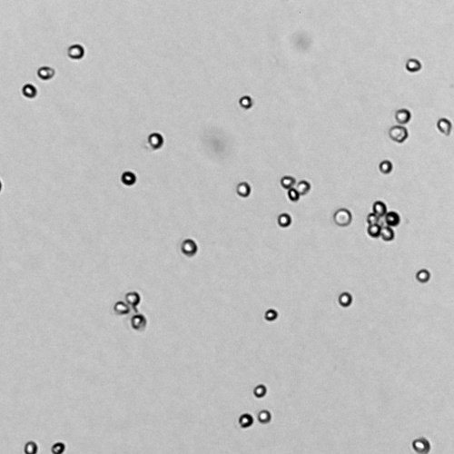
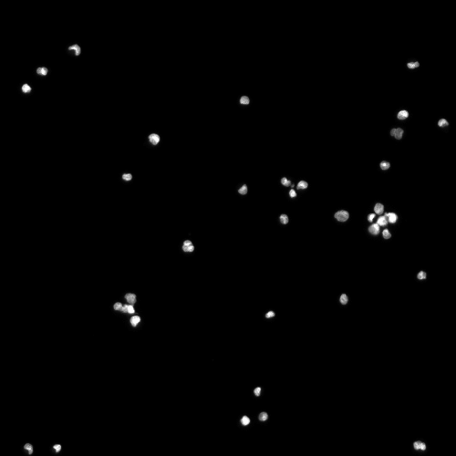

# Exercise 5 - BLOB Analysis (connected component analysis and object classification) 

The purpose of this exercise is to implement, test and validate connected component analysis methods. Also known as BLOB (binary large object) analysis.

The methods will be used to create a small program that can count cell nuclei.

# Learning Objectives

After completing this exercise, the student should be able to do the following:

1. Preprocess a colour image so it is suitable for BLOB analysis using color to gray transformations and threshold selection.
2. Use slicing to extract regions of an image for further analysis.
3. Use `segmentation.clear_border` to remove border BLOBs.
4. Apply suitable morphological operations to remove small BLOBs, close holes and generally make a binary image suitable for BLOB analysis.
5. Use `measure.label` to create labels from a binary image.
6. Visualize labels using `label2rgb`.
7. Compute BLOB features using `measure.regionprops` including BLOB area and perimeter.
8. Remove BLOBs that have certain features.
9. Extract BLOB features and plot feature spaces as for example area versus perimeter and area versus circularity.
10. Choose a set of BLOB features that separates objects from noise.
11. Implement and test a small program for cell nuclei classification and counting.


# Installing Python packages

In this exercise, we will be using [scikit-image](https://scikit-image.org/). You should have this library installed, else instructions can be found in the previous exercises.

We will use the virtual environment from the previous exercise (`course02502`). 

# Exercise data and material

The data and material needed for this exercise can be found here:
(https://github.com/RasmusRPaulsen/DTUImageAnalysis/tree/main/exercises/ex5-BLOBAnalysis/data)

# BLOB Analysis in Python 

Start by importing some function:

```python
from skimage import io, color, morphology
from skimage.util import img_as_float, img_as_ubyte
import matplotlib.pyplot as plt
import numpy as np
import math
from skimage.filters import threshold_otsu
from skimage import segmentation
from skimage import measure
from skimage.color import label2rgb
```

and define a convenience function to show two images side by side:

```python
def show_comparison(original, modified, modified_name):
    fig, (ax1, ax2) = plt.subplots(ncols=2, figsize=(8, 4), sharex=True,
                                   sharey=True)
    ax1.imshow(original)
    ax1.set_title('Original')
    ax1.axis('off')
    ax2.imshow(modified)
    ax2.set_title(modified_name)
    ax2.axis('off')
    io.show()
```

## LEGO Classification

We will start by trying some BLOB analysis approaches on a photo of some Lego bricks: **lego_4_small.png**.

### Exercise 1: Binary image from original image

Read the image, convert it to grayscale and use *Otsus* method to compute and apply a threshold. 

Show the binary image together with the original image.

### Exercise 2: Remove border BLOBs

Use `segmentation.clear_border` to remove border pixels from the binary image.

### Exercise 3: Cleaning using morphological operations

In order to remove remove noise and close holes, you should do a morphological closing followed by a morphological opening with a disk shaped structuring element with radius 5. See [Exercise 4b](https://github.com/RasmusRPaulsen/DTUImageAnalysis/tree/main/exercises/ex4b-ImageMorphology) if you are in doubt.

### Exercise 4: Find labels

The actual connected component analysis / BLOB analysis is performed using `measure.label` :

```python
label_img = measure.label(img_open)
n_labels = label_img.max()
print(f"Number of labels: {n_labels}")
```

### Exercise 5: Visualize found labels

We can use the function `label2rbg` to create a visualization of the found BLOBS. Show this together with the original image.

### Exericse 6: Compute BLOB features

It is possible to compute a wide variety of BLOB features using the `measure.regionprops` function:

```python
region_props = measure.regionprops(label_img)
areas = np.array([prop.area for prop in region_props])
plt.hist(areas, bins=50)
plt.show()
```

### Exercise 7: Exploring BLOB features

There is an example program called `Ex5-BlobAnalysisInteractive.py` in the [exercise material folder](https://github.com/RasmusRPaulsen/DTUImageAnalysis/tree/main/exercises/ex5-BLOBAnalysis/data).

With that program, you can explore different BLOB features interactively. It requires installation of `plotly`:

```
conda install -c plotly plotly=5.10.0
```


## Cell counting

The goal of this part of the exercise, is to create a small program that can automatically count the number of cell nuclei in an image.

The images used for the exercise is acquired by the Danish company [Chemometec](https://chemometec.com/) using their image-based cytometers. A cytometer is a machine used in many laboratories to do automated cell counting and analysis. An example image can be seen in below where U2OS cells  (human bone cells) have been imaged using ultraviolet (UV) microscopy and a fluorescent staining method named DAPI. Using DAPI staining only the cell nuclei are visible which makes the method very suitable for cell counting.



**U2OS cells**: To the left image acquired using UV microscopy and to the right the corresponding DAPI image.

The raw images from the Cytometer are 1920x1440 pixels and each pixel is 16 bit (values from 0 to 65535). The resolution is 1.11 $\mu m$ / pixel.

To make it easier to develop the cell counting program we start by working with smaller areas of the raw images. The images are also converted to 8 bit grayscale images:

```python
in_dir = "data/"
img_org = io.imread(in_dir + 'Sample E2 - U2OS DAPI channel.tiff')
# slice to extract smaller image
img_small = img_org[700:1200, 900:1400]
img_gray = img_as_ubyte(img_small) 
io.imshow(img_gray, vmin=0, vmax=150)
plt.title('DAPI Stained U2OS cell nuclei')
io.show()
```

As can be seen we use *slicing* to extract a part of the image. You can use `vmin` and `vmax` to visualise specific gray scale ranges (0 to 150 in the example above). Adjust these limits to find out where the cell nuclei are most visible.

Initially, we would like to apply a threshold to create a binary image where nuclei are foreground. To select a good threshold, inspect the histogram:

```python
# avoid bin with value 0 due to the very large number of background pixels
plt.hist(img_gray.ravel(), bins=256, range=(1, 100))
io.show()
```

### Exercise 8: Threshold selection
Select an appropriate threshold, that seperates nuclei from the background. You can set it manually or use *Otsus* method.

Show the binary image together with the original image and evaluate if you got the information you wanted in the binary image.


It can be seen that there is some noise (non-nuclei) present and that some nuclei are connected. Nuclei that are overlapping very much should be discarded in the analysis. However, if they are only touching each other a little we can try to separate them. More on this later.

To make the following analysis easier the objects that touches the border should be removed.

### Exercise 9: Remove border BLOBS

Use `segmentation.clear_border` to remove border pixels from the binary image.


To be able to analyse the individual objects, the objects should be
labelled.

```python
label_img = measure.label(img_c_b)
image_label_overlay = label2rgb(label_img)
show_comparison(img_org, image_label_overlay, 'Found BLOBS')
```

In this image, each object has a separate color - does it look reasonable?

### Exercise 10: BLOB features

The task is now to find some **object features** that identify the cell nuclei and let us remove noise and connected nuclei. We use the function `regionprops` to compute a set of features for each object:

```python
region_props = measure.regionprops(label_img)
```

For example can the area of the first object be seen by: `print(region_props[0].area)`.

A quick way to gather all areas:

```python
areas = np.array([prop.area for prop in region_props])
```

We can try if the area of the objects is enough to remove invalid object. Plot a histogram of all the areas and see if it can be used to identify well separated nuclei from overlapping nuclei and noise. You should probably play around with the number of bins in your histogram plotting function.


### Exercise 11: BLOB classification by area

Select a minimum and maximum allowed area and use the following to visualise the result:

```python
min_area =
max_area =

# Create a copy of the label_img
label_img_filter = label_img
for region in region_props:
	# Find the areas that do not fit our criteria
	if region.area > max_area or region.area < min_area:
		# set the pixels in the invalid areas to background
		for cords in region.coords:
			label_img_filter[cords[0], cords[1]] = 0
# Create binary image from the filtered label image
i_area = label_img_filter > 0
show_comparison(img_small, i_area, 'Found nuclei based on area')
```

Can you find an area interval that works well for these nuclei?

### Exercise 12: Feature space

Extract all the perimeters of the BLOBS:

```python
perimeters = np.array([prop.perimeter for prop in region_props])
```

Try to plot the areas versus the perimeters. 


### Exercise 13: BLOB Circularity

We should also examine if the shape of the cells can identify them. A good measure of how circular an object is can be computed as:

$$
f_\text{circ} = \frac{4 \pi A}{P^2},
$$

where $A$ is the object area and $P$ is the perimeter. A circle has a circularity close to 1, and very-non-circular object have circularity close to 0.

Compute the circularity for all objects and plot a histogram.

Select some appropriate ranges of accepted circularity. Use these ranges to select only the cells with acceptable areas and circularity and show them in an image.

### Exercise 14: BLOB circularity and area

Try to plot the areas versus the circularity. What do you observe?

Extend your method to return the number (the count) of well-formed nuclei in the image.


### Exercise 15: large scale testing
Try to test the method on a larger set of training images. Use slicing to select the different regions from the raw image. 


### Exercise 16: COS7 cell classification

Try your method on the **Sample G1 - COS7 cells DAPI channel.tiff** image.  COS7 cells are [African Green Monkey Fibroblast-like Kidney Cells](www.cos-7.com) used for a variety of research purposes.

### Exercise 17: Handling overlap

In certain cases cell nuclei are touching and are therefore being treated as one object. It can sometimes be solved using for example the morphological operation **opening** before the object labelling. The operation **erosion** can also be used but it changes the object area.


## References
- [sci-kit image label](https://scikit-image.org/docs/stable/api/skimage.measure.html#skimage.measure.label)
- [sci-kit image region properties](https://scikit-image.org/docs/stable/api/skimage.measure.html#skimage.measure.regionprops)
- [Measure region properties](https://scikit-image.org/docs/dev/auto_examples/segmentation/plot_regionprops.html)

