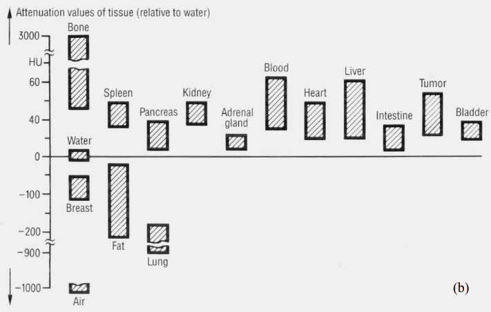
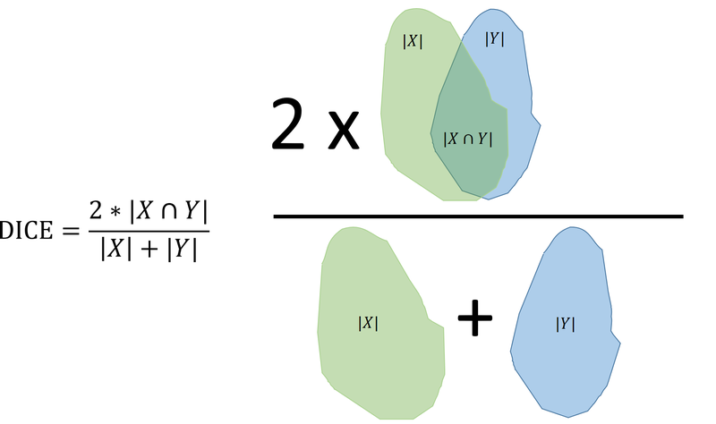

# Exercise 6 - Pixel classification and object segmentation (work in progress)

In the first part of this exercise, we will use pixel classification to label pixels in an image. In the second part, pixel classification will be combined with BLOB analysis to segment the spleen from a computed tomography (CT) scan.


## Learning Objectives

After completing this exercise, the student should be able to do the following:

1. Do Pixel classification
1. Implement, train and validate pixel classification algorithms based on minimum distance classification and parametric classification.
1. Define suitable classes given a set of input images and a goal for the segmentation.
1. Use the Matlab function \texttt{roipoly} to select regions in image that each represent a defined class.
1. Plot histograms and compute the average and standard deviations of the pixel values in each of the pre-defined classes.
1. Fit a Gaussian to a set of pixel values using the Matlab function \texttt{normpdf}.
1. Visualize and evaluate the class overlap by plotting fitted Gaussian functions of each pre-defined class.
1. Do pixel classification of an image using minimum distance classification.
1. Determine the class ranges in a parametric classifier by visual inspection of fitted Gaussian distributions.
1. Do pixel classification of an image using a parametric classifier.
1. Do colour classification by selecting class ranges in RGB space.
1. Visually evaluate colour classification by classifying unseen images.

## Installing Python packages

In this exercise, we will be using both [scikit-image](https://scikit-image.org/) and [OpenCV](https://opencv.org/). You should have these libraries installed, else instructions can be found in the previous exercises.

We will use the virtual environment from the previous exercise (`course02502`). 

## Exercise data and material

The data and material needed for this exercise can be found here: [exercise data and material]
(https://github.com/RasmusRPaulsen/DTUImageAnalysis/tree/main/exercises/ex6-PixelClassificationAndObjectSegmentation/data)

There are four training image and three test images. They have ground truth annotations of the spleen that we will use for training and testing of our algorithm.

## Abdominal computed tomography

The images in this  exercise are DICOM images from a computed tomography (CT) scan of the abdominal area. An example can be seen below, where the anatomies we are working with are marked. You should 

A CT scan is normally a 3D volume with many slices, but in this exercise, we will only work with one slice at a time. We therefore call one *slice* for an image.

In this exercise, we will mostly focus on the **spleen** but also examine the **liver, kidneys, fat tissue and bone.**


### Hounsfield units

The pixels in the images are stored as 16-bit integers, meaning their values can be in the range of [−32.768,  32.767]. In a CT image, the values are represented as [**Hounsfield units** (HU)](https://en.wikipedia.org/wiki/Hounsfield_scale). Hounsfield units are used in computed tomography to characterise the X-ray absorption of different tissues. A CT scanner is normally calibrated so a pixel with Hounsfield unit 0 has an absorbance equal to water and a pixel with Hounsfield unit -1000 has absorbance equal to air. Bone absorbs a lot of radiation and therefore have high HU values (300-800) and fat absorbs less radiation than water and has HU units around -100. Several organs have similar HU values since the soft-tissue composition of the organs have similar X-ray absorption. In the figure below (from Erich Krestel, "Imaging Systems for Medical Diagnostics", 1990, Siemens) some typical HU units for organs can be seen. They are, however, not always consistent from scanner to scanner and hospital to hospital. 




## Explorative analysis of one CT scan

Let us start by examining one of the CT scan slices from the training set. You can read the first slice like this:

```python
in_dir = "data/"
ct = dicom.read_file(in_dir + 'Training.dcm')
img = ct.pixel_array
print(img.shape)
print(img.dtype)
```

You should visualise the slice, so the organs of interest have a suitable brigthness and contrast. One way is to manipulate the minimum and maximum values proviede to `imshow`.

**Exercise 1**: *The spleen typically has HU units in the range of 0 to 150. Try to make a good visualization of the CT scan and spleen using (replace the question marks with values):*

```python
io.imshow(img, vmin=?, vmax=?, cmap='gray')
io.show()
```

An expert has provided annotations of **bone, fat, kidneys, liver and spleen**. They are stored as *mask* files which is an image with the same size as the input image, where the annotated pixels are 1 and the rest are 0. They are found as **BoneROI.png, FatROI.png, KidneyROI.png, LiverROI and SpleenROI.png**.

You can use the original image and a mask to get the values of the pixels inside the mask:

```python
spleen_roi = io.imread(in_dir + 'SpleenROI.png')
# convert to boolean image
spleen_mask = spleen_roi > 0
spleen_values = img[spleen_mask]
```

**Exercise 2**: *Compute the average and standard deviation of the Hounsfield units found in the spleen in the training image. Do they correspond to the values found in the above figure?*

**Exercise 3**: *Plot a histogram of the pixel values of the spleen. Does it look like they are Gaussian distributed?*


The function [`norm.pdf`](https://docs.scipy.org/doc/scipy/reference/generated/scipy.stats.norm.html) from `SciPy`  represents a Gaussian probability density function (PDF). It can for example be used to plot a Gaussian
distribution with a given mean and standard deviation.

This can be used to create a fitted Gaussian distribution of the spleen values:

```python
n, bins, patches = plt.hist(spleen_values, 60, density=1)
pdf_spleen = norm.pdf(bins, mu_spleen, std_spleen)
plt.plot(bins, pdf_spleen)
plt.xlabel('Hounsfield unit')
plt.ylabel('Frequency')
plt.title('Spleen values in CT scan')
plt.show()
```

Here `mu_spleen` and `std_spleen` are the average and standard deviation of the spleen values.

**Exercise 4**: *Plot histograms and their fitted Gaussians of several of the tissues types. Do they all look like they are Gaussian distributed?*

The fitted Gaussians are good for inspecting class separation and how much the class overlap. Plotting several fitted Gaussians can for example be done like this:

```python
# Hounsfield unit limits of the plot
min_hu = -200
max_hu = 1000
hu_range = np.arange(min_hu, max_hu, 1.0)
pdf_spleen = norm.pdf(hu_range, mu_spleen, std_spleen)
pdf_bone = norm.pdf(hu_range, mu_bone, std_bone)
plt.plot(hu_range, pdf_spleen, 'r--', label="spleen")
plt.plot(hu_range, pdf_bone, 'g', label="bone")
plt.title("Fitted Gaussians")
plt.legend()
plt.show()
```

**Exercise 5**: *Plot the fitted Gaussians of bone, fat, kidneys, liver and spleen. What classes are easy to seperate and which classes are hard to seperate?*

**Exercise 6**: *Define the classes that we aim at classifying. Perhaps some classes should be combined into one class?*


## Minimum distance pixel classification

In the **minimum distance classifier** the pixel value class ranges are defined using the average values of the training values. If you have two classes, the threshold between them is defined as the mid-point between the two class value averages.

In the following, we will define four classes: **background, fat, soft tissue and bone**, where soft-tissue is a combination of the values of the spleen, liver and kidneys. 
We manually set the threshold for background to -200. So all pixels below -200 are set to background.

**Exercise 7**: *Compute the class ranges defining fat, soft tissue and bone.*

You can now use:

```python
t_background = -200
fat_img = (img > t_background) & (img <= t_fat_soft)
```

to create an image where all the pixel that are classified as fat, will be 1 and the rest 0. Here `t_fat_soft` is the threshold between the fat and the soft tissue class.
 

**Exercise 8**: *Create class images: fat_img, soft_img and bone_img representing the fat, soft tissue and bone found in the image.*

To visualize the classification results you can use:

```python
label_img = fat_img + 2 * soft_img + 3 * bone_img
image_label_overlay = label2rgb(label_img)
show_comparison(img, image_label_overlay, 'Classification result')
```

**Exercise 9**: *Visualize your classification result and compare it to the anatomical image in the start of the exercise. Does your results look plausible?*

## Parametric pixel classification

In the **parametric classifier**, the standard deviation of the training pixel values is also used when determinin the class ranges. In the following, we are also trying to classify **background, fat, soft tissue and bone**.

We start by finding the class ranges by manually inspecting the fitted Gaussians from each class.

As in the last exercise, we can still se the background-fat threshold to be -200.

**Exercise 9**: *Plot the fitted Gaussians of the training values and manually find the intersection between the curves.*

**Exercise 10**: *Use the same technique as in exercise 7, 8 and 9 to visualize your classification results. Did it change compared to the minimum distance classifier?*

An alternative way of finding the class ranges is to test which class has a the highest probability for a given value. The `norm.pdf` function can be used for that. For example:

```python
if norm.pdf(test_value, mu_soft, std_soft) > norm.pdf(test_value, mu_bone, std_bone):
	print(f"For value {test_value} the class is soft tissue")
else:
	print(f"For value {test_value} the class is bone")
```

here the `test_value` is a pixel value that you want to assign a class. One way to use this is to create a *look-up-table* where for each possible HU unit (for example 100, 101, 102 etc), the most probably class is noted. Doing this will give you the pixel value, where the two neighbouring classes meet.

**Exercise 11**: *Use `norm.pdf` to find the optimal class ranges between fat, soft tissue and bone.*


## Object segmentation - The spleen finder

The goal of this part of the exercise, is to create a program that can automatically segment the spleen in CT images.

We start by using the **Training.dcm** image and the expert provided annotations.

**Exercise 11**: *Inspect the values of the spleen as in exercise 3 and select a lower and upper threshold to create a spleen class range.*

You can now use:

```python
spleen_estimate = (img > t_1) & (img < t_2)
spleen_label_colour = color.label2rgb(spleen_estimate)
io.imshow(spleen_label_colour)
plt.title("First spleen estimate")
io.show()
```

to show your first spleen estimate. As can be seen, there a many non-spleen areas in the result. The spleen is also connected to another anatomy. 

Luckily, we can use [morphological operations](https://github.com/RasmusRPaulsen/DTUImageAnalysis/tree/main/exercises/ex4b-ImageMorphology) to fix these issues:


```python
footprint = disk(?)
closed = binary_closing(spleen_estimate, footprint)

footprint = disk(?)
opened = binary_opening(closed, footprint)
```

**Exercise 12**: *Use the above morphological operations to seperate the spleen from other organs and close holes. Change the values where there are question marks to change the size of the used structuring elements.*


Now we can use [BLOB](https://github.com/RasmusRPaulsen/DTUImageAnalysis/tree/main/exercises/ex5-BLOBAnalysis) analysis to do a feature based classification of the spleen.

**Exercise 12**: *Use the methods from BLOB analysis to compute BLOB features for every seperated BLOB in the image. You can for example start by:*
 
```python
label_img = measure.label(opened)
```

**Exercise 13**: *Inspect the labeled image and validate the success of separating the spleen from the other objects. If it is connected (have the same color) to another organ, you should experiment with the kernel sizes in the morphological operations.*


To be able to keep only the spleen we need to find out which BLOB features, that is special for the spleen. By using `measure.regionprops` many different BLOB features can be computed, including area and perimeter.

You can for example use:

```python
min_area = ?
max_area = ?

# Create a copy of the label_img
label_img_filter = label_img.copy()
for region in region_props:
	# Find the areas that do not fit our criteria
	if region.area > max_area or region.area < min_area:
		# set the pixels in the invalid areas to background
		for cords in region.coords:
			label_img_filter[cords[0], cords[1]] = 0
# Create binary image from the filtered label image
i_area = label_img_filter > 0
show_comparison(img, i_area, 'Found spleen based on area')
```

to create a filtered binary image, where only valid BLOBs are remaining. 

**Exercise 14**: *Extend the method above to include several BLOB features. For example area and perimeter. Find the combination of features and feature value limits that will result in only the spleen remaining.*

**Exercise 15**: *Create a function `spleen_finder(img)` that takes as input a CT image and returns a binary image, where the pixels with value 1 represent the spleen and the pixels with value 0 everything else.*

**Exercise 16**: *Test your function on the images called **Validation1.dcm**,  **Validation2.dcm** and **Validation3.dcm**. Do you succeed in finding the spleen in all the validation images?*
  

## DICE Score

We would like evaluate how good we are at finding the spleen by comparing our found spleen with ground truth annotations of the spleen. The **DICE score** (also called the DICE coefficient or the DICE distance) is a standard method of comparing one segmentation with another segmentation.

If segmentation one is called `X` and the second segmentation called `Y`. The DICE score is computed as:

$$
\text{DICE} = \frac{2 |X \cap Y|}{|X| + |Y|}
$$

where $|X \cap Y|$ is the area (in pixels) of the overlap of the two segmentations and is $|X| + |Y|$ the area of the union of the two segmentation. This can be visualized as:

 


## References

- [Normal distribution](https://docs.scipy.org/doc/scipy/reference/generated/scipy.stats.norm.html)
- [DICE dissimilarity](https://docs.scipy.org/doc/scipy/reference/generated/scipy.spatial.distance.dice.html)

