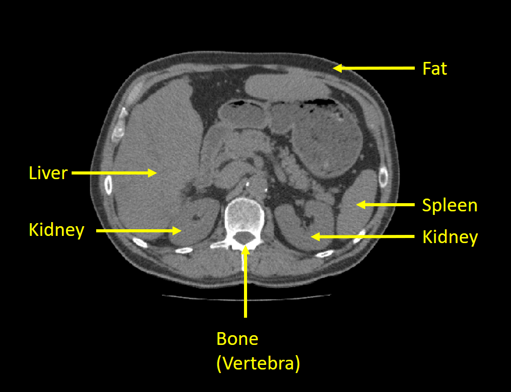

# Exercise 6 - Pixel classification and object segmentation (work in progress)

In the first part of this exercise, we will use pixel classification to label pixels in an image. In the second part, pixel classification will be combined with BLOB analysis to segment organs from a computed tomography (CT) scan.

## Learning Objectives

After completing this exercise, the student should be able to do the following:

1. Do Pixel classification
1. Implement, train and validate pixel classification algorithms based on minimum distance classification and parametric classification.
1. Define suitable classes given a set of input images and a goal for the segmentation.
1. Use the Matlab function \texttt{roipoly} to select regions in image that each represent a defined class.
1. Plot histograms and compute the average and standard deviations of the pixel values in each of the pre-defined classes.
1. Fit a Gaussian to a set of pixel values using the Matlab function \texttt{normpdf}.
1. Visualize and evaluate the class overlap by plotting fitted Gaussian functions of each pre-defined class.
1. Do pixel classification of an image using minimum distance classification.
1. Determine the class ranges in a parametric classifier by visual inspection of fitted Gaussian distributions.
1. Do pixel classification of an image using a parametric classifier.
1. Do colour classification by selecting class ranges in RGB space.
1. Visually evaluate colour classification by classifying unseen images.

## Installing Python packages

In this exercise, we will be using both [scikit-image](https://scikit-image.org/) and [OpenCV](https://opencv.org/). You should have these libraries installed, else instructions can be found in the previous exercises.

We will use the virtual environment from the previous exercise (`course02502`). 

## Exercise data and material

The data and material needed for this exercise can be found here: [exercise data and material]
(https://github.com/RasmusRPaulsen/DTUImageAnalysis/tree/main/exercises/ex6-PixelClassificationAndObjectSegmentation/data)

## Abdominal computed tomography

The images in this  exercise are DICOM images from a computed tomography (CT) scan of the abdominal area. An example can be seen below, where the anatomies we are working with are marked.

A CT scan is normally a 3D volume with many slices, but in this exercise, we will only work with one slice at a time. We therefore call one *slice* for an image.

### Hounsfield units

The pixels in the images are stored as 16-bit integers, meaning their values can be in the range of [−32.768,  32.767]. In a CT image, the values are represented as **Hounsfield units** (HU). Hounsfield units are calibrated such that an area containing water will have a HU value of 0 and an area containing air will have HU value of -1000.  

## Pixel Classification

## References

- 
